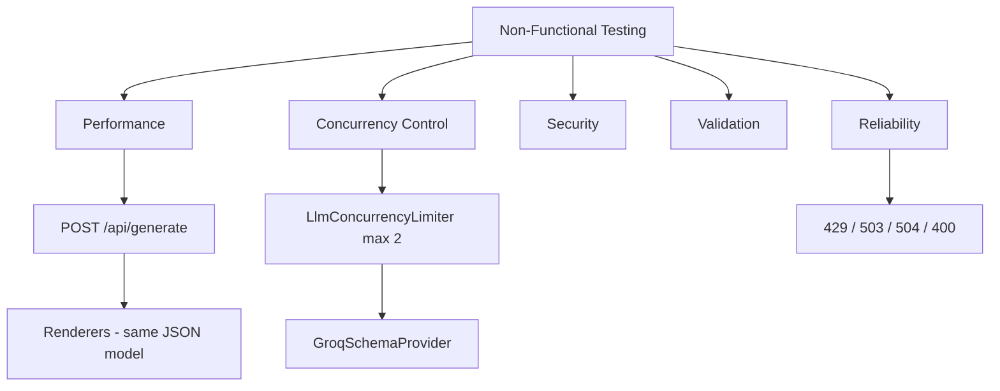

# Non-Functional Testing Results

## Slide Summary

DBC converts business rules into SQL, Prisma, or TypeORM via **POST `/api/generate`** and **Groq**. We added **25 e2e** and **69 backend** automated tests plus **autocannon** load tests. After fixing **LLM concurrency control** and **error classification**, **Prisma and TypeORM reached 100% success** under 2 concurrent clients (10 s), with average latencies ~2.7–3.2 s. All Jest tests pass.

## Testing Categories

1. **Performance / load** — autocannon, real Groq, SQL/Prisma/TypeORM payloads.
2. **Reliability** — timeouts, rate limits, invalid JSON, provider unavailable.
3. **Security** — prompt injection, oversized input, SQL as text only.
4. **Validation** — DTO, Zod, whitelist.
5. **Concurrency** — parallel Prisma/TypeORM requests, Groq slot limiter.

## Tested Components

`GenerateController` → `GenerateService` → `LlmJsonService` → `GroqSchemaProvider` (with `LlmConcurrencyLimiter`) → `DatabaseOutputService` → SQL/Prisma/TypeORM renderers.

## Metrics Collected

| Area | Result |
|------|--------|
| Jest NF e2e | **25/25 passed** |
| Backend tests | **69/69 passed** |
| Load Prisma | **4/4 success**, 0% errors, avg **2731 ms** |
| Load TypeORM | **3/3 success**, 0% errors, avg **3178 ms** |
| Error codes | **429** rate limit, **503** unavailable, **504** timeout |

## Tools Used

Jest, Supertest, autocannon, Nx, live Groq API.

## Results Table

| Test | Status |
|------|--------|
| API / validation | Passed |
| Reliability | Passed |
| Security | Passed |
| Concurrency e2e | Passed |
| Load Prisma / TypeORM | **Passed** (post-fix) |
| Load SQL (first scenario) | Partial (quota burst) |

## Diagram Data

## Short Conclusion

The system is **safe and validated** under automated tests. **Concurrency limiting** and clearer **provider errors** stabilized Prisma and TypeORM under load. Production should set `LLM_MAX_CONCURRENT_REQUESTS` to match Groq tier; load tests should use **cooldown between scenarios** and a **long HTTP timeout** for LLM latency.
